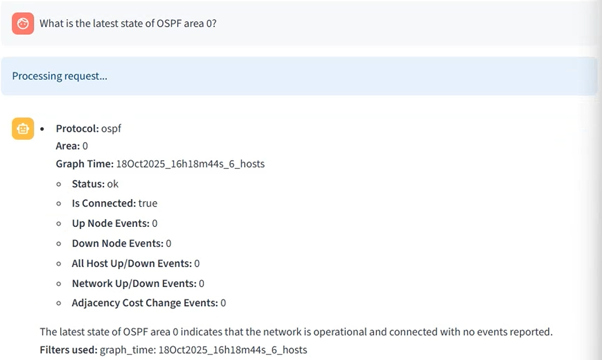
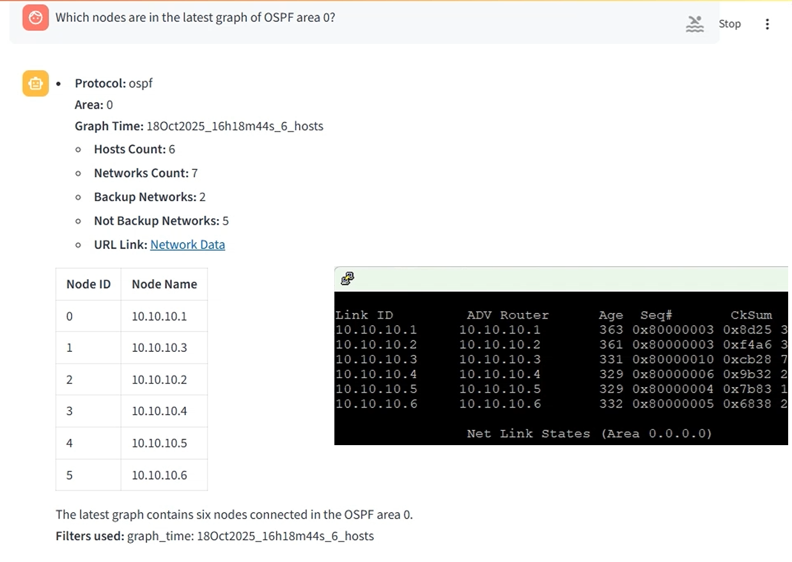
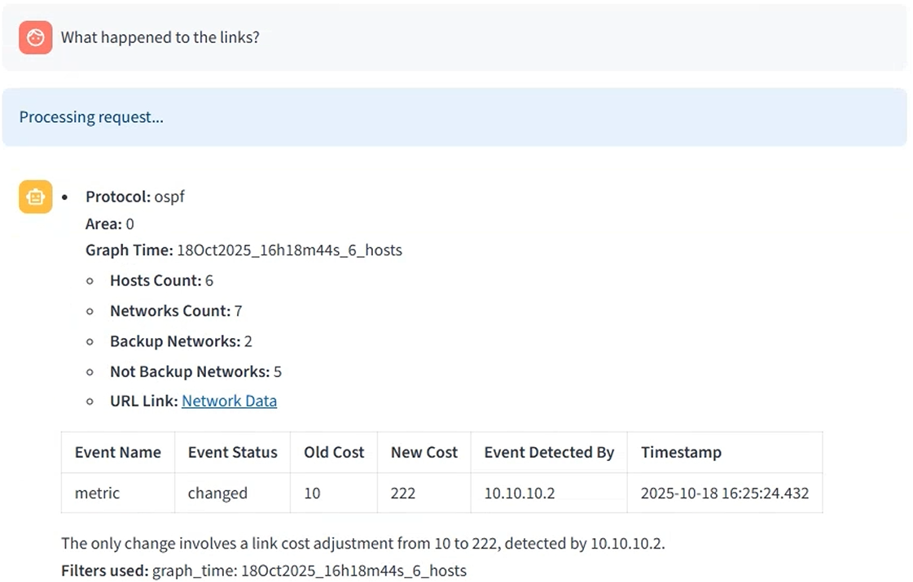

# Network AI Assistant

A Streamlit-based AI agent for network assistance with OSPF/IS-IS capabilities. Works with Topolograph MCP.  
Interact naturally with OSPF/IS-IS protocols, for instance you can ask:
* Which graphs are currently connected?
* What nodes are in the latest OSPF area 0 graph?
* Which networks are assigned to a specific host?
* What is the route between two IP addresses?
* What happened to the links after topology changes?

## Quick Start

### Prerequisites

0. **Register on OpenAI and generate API token:**
   - Go to [https://platform.openai.com/](https://platform.openai.com/)
   - Create an account and generate an API token
   - Note: For repeating the demo setup, you'll need approximately less than $1 in your OpenAI balance
   - *Note: Local LLM setup using vLLM is under development*

### Using Docker Compose

Current setup uses public OpenAI models, so it means that if you use local MCP connection, it's needed to expose local MCP to the OpenAI.

#### 1. Establish tunnel to make your local MCP publicly available

##### Cloudflare Tunnel
1. **Run with Cloudflare tunnel:**
   ```bash
   docker-compose --profile cloudflare up --build
   ```

2. **Wait for tunnel establishment:**
   - The Cloudflare tunnel will create a secure connection
   - The public tunnel URL will be displayed in the logs
   - Look for output like: `https://your-tunnel-url.trycloudflare.com`

##### Ngrok (Free alternative)
If you prefer ngrok (requires free registration at https://ngrok.com):

1. **Install ngrok:**
   ```bash
   # Download from https://ngrok.com/download
   # Or using package manager
   sudo apt install ngrok  # Ubuntu/Debian
   ```

2. **In a separate terminal, establish ngrok tunnel:**
   ```bash
   # For the Streamlit web UI (port 8501)
   ngrok http 8501
   
   # For Topolograph's MCP server (port 8080)
   # Topolograph's MCP server is published via Nginx, which is available via 8080 `TOPOLOGRAPH_PORT` variable in `env` file
   ngrok http 8080
   ```

#### 2. Copy URL into `.env`

Copy the tunnel URL (from Cloudflare or ngrok) into your `.env` file:
```
# Add your tunnel URL here
MCP_SERVER_URL=https://your-tunnel-url.trycloudflare.com
# or
MCP_SERVER_URL=https://abc123.ngrok.io
```

#### 3. Start the application

1. **Run the application:**
   ```bash
   docker-compose up --build
   ```

2. **Access the web UI:**
   - **Local:** http://localhost:8501

## Demo Video

Watch the Network AI Assistant in action: [YouTube Demo](https://youtu.be/92YBRXqZWUo)

## Demo Setup

To repeat the same demo on your host:

1. **Clone and setup Topolograph with OSPF lab:**
   ```bash
   git clone https://github.com/Vadims06/topolograph-docker
   cd topolograph-docker
   sudo ./install.sh
   ```
   This will setup all required packages and start the Topolograph service with MCP protocol and OSPF local lab.

2. **Start the Network AI Assistant:**
   ```bash
   # In this repository
   docker-compose up --build
   ```

## Screenshots

### Main Application Interface


### OSPF Network Analysis


### Network State After Link Changes


## Development

The application uses Streamlit and includes MCP (Model Context Protocol) functions for network analysis.

### Environment Variables
Copy from `.env.template` and configure:
```bash
cp .env.template .env
# Edit .env with your configuration
```

### Local Development
```bash
pip install -r requirements.txt
streamlit run app.py
```

# Online Resources. Contacts
* Telegram group: [https://t.me/topolograph](https://t.me/topolograph)
* Main site: https://topolograph.com
* Docker version of site: https://github.com/Vadims06/topolograph-docker
* MCP: https://github.com/Vadims06/topolograph-mcp-server